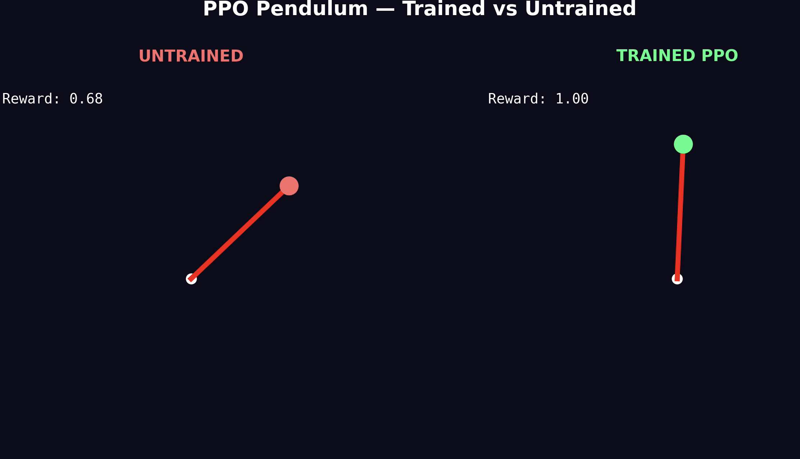

# PPO Pendulum — Proximal Policy Optimization from Scratch

A from-scratch implementation of Proximal Policy Optimization (PPO) for continuous control. Trained on a custom Pendulum environment with physics built from Newton's laws. Every line — physics simulation, actor-critic networks, GAE advantage estimation, and clipped policy updates — built with NumPy. No PyTorch. No TensorFlow. No RL libraries.



## Project Structure

```
├── PPO.py                     # Training loop + animated comparison
├── ActorAndCritic.py          # Actor and Critic neural networks
├── PendulumPPOk.txt           # What I learned — knowledge consolidation
├── Untrained_VS_Trained.png   # Side-by-side comparison
└── README.md
```

## How It Works

### The Pendulum Environment

A rod of length 1m, mass 1kg, pivoted at one end. The agent applies torque between -2.0 and +2.0 to swing the rod upright and keep it balanced. Gravity pulls it down. The state is `[cos(θ), sin(θ), θ_dot]`. The reward is `cos(θ) - 0.1·θ_dot² - 0.001·torque²`.

Built from scratch using Newton's second law for rotation and Euler integration at 50fps.

### PPO Architecture

**Actor (Policy Network)**
```
Input:  3 (cos θ, sin θ, θ_dot)
Hidden: 64 (tanh)
Hidden: 64 (tanh)
Output: mean (torque), std (exploration)
```

The actor outputs a Gaussian distribution. Actions are sampled from `N(mean, std)`. The std naturally shrinks as the policy improves — no explicit exploration schedule needed.

**Critic (Value Network)**
```
Input:  3 (state)
Hidden: 64 (tanh)
Hidden: 64 (tanh)
Output: 1 (predicted value V(s))
```

The critic predicts the expected return from each state. Its predictions flow into GAE to compute advantages, which train the actor.

### Training

```
1. Collect 2048 timesteps using current policy
2. Compute advantages with GAE (γ=0.9, λ=0.95)
3. For 10 epochs:
   - Compute clipped PPO objective
   - Update actor (policy gradient)
   - Update critic (MSE on returns)
4. Repeat for 500 episodes
```

**Key hyperparameters:**
- Clip range: 0.2
- Learning rate: 0.003
- Batch size: 64
- GAE gamma: 0.9, lambda: 0.95

## Results

After 500 episodes, the trained policy achieves an average reward of ~0.90-0.95, spending most of its time nearly upright with minimal torque. The untrained policy oscillates randomly with rewards around -4.0.

The side-by-side animation shows the contrast — chaotic flailing vs smooth swing-up and balance.

## The PPO Clipping Trick

PPO's key innovation is the clipped objective:

```python
ratio = new_prob / old_prob
clipped = clip(ratio, 0.8, 1.2)
loss = -min(ratio * advantage, clipped * advantage)
```

When the policy changes too much (ratio outside [0.8, 1.2]), the gradient becomes zero. This prevents catastrophic updates while allowing steady improvement. The policy naturally stabilizes at ~20% change per update cycle.

## What I Learned

See `PendulumPPOk.txt` for detailed notes on:
- Actor-Critic architecture and why both networks are needed
- How GAE bridges the critic and actor through advantages
- Why the clipped PPO objective prevents catastrophic forgetting
- The intuition behind d_mean and d_std gradients

## Usage

```bash
python PPO.py
```

Runs training and displays the trained-vs-untrained animation.

## Dependencies

```bash
pip install numpy matplotlib
```

## Lessons from Building This

- **Shape bugs are the hardest**: `(64,)` vs `(64,1)` broadcasting silently creates `(64,64)` tensors. Reshape advantages explicitly.
- **Action must be a scalar**: `np.random.normal(mean, std)` returns `(1,1)`. Use `.item()` before passing to the environment.
- **Seeds matter**: Seed 42 consistently converges. Other seeds sometimes stall at -4.0. PPO is sensitive to initialization.
- **Tanh > ReLU for control**: Bounded activations prevent gradient explosions that ReLU can cause in value networks.
- **The critic is indirect**: It never touches the actor. It influences through advantages. Easy to miss where the interaction happens.
